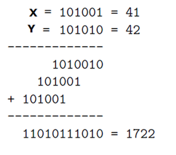

# 책소개

- [알고리즘 : 컴퓨터 과학의 기본, 숫자 알고리즘에서 양자 알고리즘까지](http://www.yes24.com/24/goods/24937708?scode=032&OzSrank=8)
- 산죠이 다스굽타,크리스토스 파파디미트리우,우메쉬 바지라니 공저
- 알고리즘 단순 풀이보다는 알고리즘을 작동시키는 수학적 지식을 전달하고 있어, 재밌게 읽을 수 있음

# 프롤로그

## 알고리즘 용어의 탄생 배경

- 알콰리즈미<sup>Al Khwarizmi</sup>라는 사람이 십진법을 활용한 여러가지 수학적 방법들을 책에 기록함.
- 이 방법들은 간결했고, 모호하지 않고, 오류가 없었음. 즉, [알고리즘](https://en.wikipedia.org/wiki/Algorithm)임.
- 그리고 십진법이 널리 전파되는데 가장 큰 기여를 함.
- 알고리즘<sup>Algorithm</sup>이란 용어는 이를 기리기 위해 만들어 짐.

## 피보나치에 대하여

- 피보나치<sup>Fibonacci</sup>는 자리법 표기의 유용함(알콰리즈마의 업적)을 널리 알리고자 노력함.
- 피보나치 수열로 더 유명하며, 이 수열은 아래와 같이 정의함.
- F<sub>0</sub> = 1, F<sub>1</sub> = 1 (seed values)
- F<sub>n</sub> = F<sub>n-1</sub> + F<sub>n-2</sub>

### 지수 알고리즘

- F<sub>100</sub>이나 F<sub>200</sub>의 값은 얼마인가?
- 이를 해결하는 한가지 알고리즘은 F<sub>n</sub>의 재귀적 정의를 그대로 수행하는 것.
- 의사코드는 아래와 같음.

```
function fib1(n)
if n = 0: return 0
if n = 1: return 1
return fib1(n-1) + fib2(n-2)
```

- 그리고 이 알고리즘은 수행 시간은 다음과 같음. (책에서는 조금 다른 기준을 사용하는데, 개인적으로 이해하기 쉬운 함수 실행수를 기준으로 바꾸어 기록함)
- T(n) = 1 (n = 0, n = 1)
- T(n) = T(n-1) + T(n-2) + 1 (n > 1)
- 이를 F<sub>n</sub>의 점화식<sup>recurrence relation</sup>과 비교해보면, T(n) ≥ F<sub>n</sub>가 됨. (여기서 F<sub>n</sub>의 점화식이란, n이 2이상인 경우의 함수 결과값을 가리킴)
- F<sub>n</sub>은 거듭제곱<sup>exponentiation</sup>(2^n)만큼 증가함.
- 즉, 수행시간이 지수적으로 증가함.
- 지수적 시간의 저주에 대해서도 소개하고 있음.

*참고로, 알고리즘의 수행시간을 표기하는 방법에 대해서는, [Khan Academy의 점근적 표기법](https://ko.khanacademy.org/computing/computer-science/algorithms/asymptotic-notation/a/asymptotic-notation)을 참고.

### 다항 시간 알고리즘

- `fib1`이 느린 이유는 재귀 호출 트리를 보면 잘 이해할 수 있음. ([여기](https://www.ics.uci.edu/~eppstein/161/960109.html)를 참고)
- 아래 의사코드처럼, 중간 결과들을 저장하면 수행시간이 다항시간으로 줄어듬.

```
function fib2(n)
if n = 0: return 0
create an array f[0 ... n]
f[0] = 0, f[1] = 1
for i = 2 ... n:
  f[i] = f[i - 1]
return f[n]
```

## O 표기법

- 책에서는 Big-O 표기법을 아래와 같이 설명함.

> f(n)과 g(n)을 양의 정수로부터 양의 실수로의 함수라고 하자. 어떤 상수 c에 대해 f(n) ≤ c*g(n)을 만족하는 상수 c가 있으면, f=O(g)(f는 g보다 빨리 증가하지 않는다는 의미)라고 한다.

- Big-θ와 Big-Ω에 대해서도 설명함.

> f = Ω(g)는 g = O(f)를 의미한다.
> f = θ(g)는 f = O(g)이고 f = Ω(g)를 의미한다.

- 마지막으로 Big-O의 일반적 규칙을 4가지를 소개함.
- 상수 배는 생략한다.
- a>b이면 n<sup>b</sup>를 생략하고 n<sup>a</sup>만 남긴다.
- 지수식과 다항식이 있으면 지수식만 남긴다.
- 다항식과 로그식이 있으면 다항식만 남긴다.

# 숫자 알고리즘

## 기본 산술 연산

### 덧셈

아래는 십진수의 기본 속성을 설명함.

> 세 개의 한 자릿수를 더한 합계는 최대 두 자릿수를 넘을 수 없다.

이는 이진수에도 적용하여, 아래 그림과 같은 알고리즘을 생각할 수 있다.


*그림 출처: http://chortle.ccsu.edu/assemblytutorial/Chapter-08/ass08_3.html

수행 시간은 어떠한가?

- 책에서는 c<sub>0</sub> + c<sub>1</sub>n 이라고 표기함.
- 여기서 c<sub>0</sub>과 c<sub>1</sub>은 상수를 가리키며, 따라서 수행시간은 선형적임.
- 참고로, 상수를 단지 c<sub>0</sub>와 c<sub>1</sub>으로 표기한 이유는, 여기서 중요한 값이 아니라는 의도로 보여짐.

수행시간이 더 빠른 알고리즘은 없는가?

- 각 자릿수의 수를 모두 더하려면 최소한 두 수를 읽고, 결과를 써야 하며, n 번의 연산을 수행해야 함.
- 따라서 위 알고리즘이 최적이라고 볼 수 있음.

### 곱셈과 나눗셈

그림으로 알고리즘을 살펴보면 아래와 같다.



마찬가지로 수행시간은 얼마나 될까?

- 위 그림에서 Y의 자릿수가 n인 경우, 중간값이 n개 생김.
- 중간값들은 자릿수만큼 왼쪽으로 이동했으므로, 최대 2n 자리의 숫자가 됨.
- 이 중간값들을 더하는 데 걸리는 총 시간은 아래와 같음.
- O(n) + O(n) + … + O(n) : 총 n-1번 수행 = O(n^2)
- 다항 시간이긴 하지만, 덧셈보다는 느림.

알콰리즈미가 알아낸 또다른 곰셈법도 있음.


*그림 출처: https://sites.google.com/site/markdolanprogramming/cis-3223/algorithms-chapter-1

- x와 y가 있을때, x는 계속 반으로 나누고 나머지를 버리고 y는 계속 2를 곱함.
- x가 1이 될 때까지 계속 반복함.
- x의 수들 중 짝수인 열을 제외하고 y의 숫자들을 모두 더함.
- 의사코드는 아래와 같음. (개인적으로 좀 더 잘 이해하기 위해, 책과 다르게 x, y를 서로 바꿈)

```
function multiply(x, y)
입력: n비트의 두 정수 x와 y, y ≥ 0
출력: 두 수의 곱

if x = 0: return 0
z = multiply(y, ⎣x/2⎦)
if x is even:
  return 2z
else:
  return y + 2z
```

수행시간은?

- 일단 n번의 재귀호출이 발생함.
- 재귀호출마다 2로 나누기(비트  우측 시프트), 홀수 여부 검사(마지막 비트 검사), 2 곱하기(비트 좌측 시프트), 한 번의 덧셈이 발생하므로, 총 O(n)번의 비트 연산이 수행됨.
- 전체 수행 시간은 O(n^2)이며 앞서 소개한 곱셈 알고리즘과 동일함.
- 이보다 더 나은 알고리즘도 있으나, 2장에서 소개될 예정이라고 함. 아마도 [카라추바 알고리즘](https://ko.wikipedia.org/wiki/%EC%B9%B4%EB%9D%BC%EC%B6%94%EB%B0%94_%EC%95%8C%EA%B3%A0%EB%A6%AC%EC%A6%98)일듯.

다음은 나눗셈 알고리즘이다. 의사 코드는 아래와 같다.

```
function divide(x, y)
입력: n 비트의 두 정수 x와 y, y ≥ 1
출력: x를 y로 나눌 때 몫과 나머지

if x = 0: return (q, r) = (0, 0)
(q, r) = divide(⎣x/2⎦, y)
q = 2*q, r = 2*r
if x is odd: r = r + 1
if r ≥ y: r = r - y, q = q + 1
return (q, r)
```

- `x = yq + r`이고 `r < y`를 성립하는 몫 `q`와 나머지 `r`을 찾는 과정임.
- 수행시간은 n^2에 비례함.

## 모듈러 연산

TBD