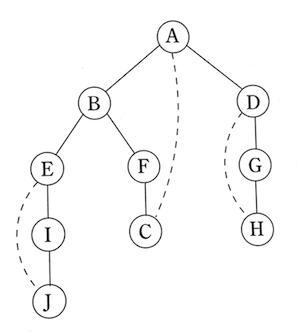
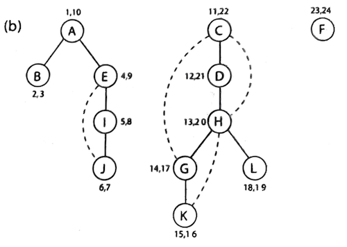
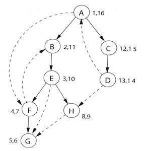

# 그래프의 분할

## 왜 그래프인가?

- 지도에서 국가마다 색칠을 하는데, 인접한 국가는 다른 색을 입혀야 한다고 해보자.
- 이를 위해, 각 나라는 정점으로, 인접해 있는지 여부는 간선으로 나타낼 수 있음. 즉 관심사만을 표현.
- 책에서는 이를 가리켜 그래프 색칠<sup>Graph coloring</sup>이라고 부름.

### 그래프 형식

- 형식적으로 그래프는 정점(또는 노드)의 집합 V와 간선 E로 표현.

```
V = {1, 2, 3, …, 13}
e = {x, y}
```

- 이 때의 x, y는 'x가 y와 경계를 공유한다'는 의미.
- 방향이 없으며, 무방향 그래프<sup>undirected graph</sup>라고 함.
- 한편, 방향이 있는 간선도 있음. 그럴 때는 방향이 있는 간선을 사용해야 함.
- e = (x, y)라고 쓰고, x로부터 y로의 유향 간선이라고 읽음.
- 유향 그래프<sup>directed graph</sup>의 예로는 WWW의 모든 링크를 나타낸 그래프.

### 그래프를 어떻게 표현할까?

인접 행렬<sup>adjacency matrix</sup>로 표현

- n = |V|인 정점들 v1, v2, …, vn이 있다면,
- (i, j)번째 항목이 다음과 같은 n x n 배열이 됨.

```mathematica
a_{ij} = \begin{cases} 1  & v_{i}\text{에서 }v_j\text{까지 간선이 있다면} \\ 0 & \text{그렇지 않다면} \end{cases}
```

- 무방향 그래프에 대한 행렬은 대칭.
- 특정 간선의 존재를 단지 하나의 메모리에 접근하여 상수 시간 내로 파악 가능.
- 하지만, O(n^2) 공간을 차지하고, 간선이 많지 않다면 비효율적.

인접 리스트<sup>adjacency list</sup>로 표현

- 정점마다 하나씩, |V|개의 연결 리스트로 구성.
- 정점 u에 대한 연결 리스트는 u가 향하는 정점들의 이름을 지님.
- 유향 그래프이면 각 간선은 연결 리스트 하나에 나타나고, 무향 그래프이면 두 개에 나타남.
- 어느 쪽이든 자료 구조 전체 크기는 O(|E|).
- 다만, 간선(u, v)를 조사하는 것은 더 이상 상수 시간이 아님.
- u의 인접 리스트를 통해 알아내야 하기 때문임.

## 무방향 그래프에서의 깊이 우선 탐색

### 미로 찾기

> "주어진 하나의 정점으로부터 그래프의 어떤 부분에 도달할 수 있는가?"

- 위 질문은 깊이 우선 탐색이 해결하려는 근본적 문제. 이는 미로 찾기와 비유됨.
- 미로 탐색에 필요한 것은 실 꾸러미와 분필.
- 분필로 이미 방문한 교차로를 표시. 같은 곳을 순환하지 않음.
- 실 꾸러미는 언제든 출발점으로 돌아올 수 있게 함.
- 미분필 표시는 부울 변수. 실 꾸러미는 스택 혹은 재귀.
- 코드는 아래와 같음. 참고로, `previsit`, `postvisit`이 뭔가 싶었는데, 이 작업의 활용을 뒤에서 소개함.

```
procedure explore(G, v)
Input: G = (V, E) is a graph; v ∈ V
Output: visited(u) is set to true for all nodes u reachable from v

visited(v) = true
previsit(v)
for each edge (v, u) ∈ E :
  if not visited(u): explore(G, u)
postvisit(v)
```

- 아래 그림은 그래프에 대한 `explore`를 표현한 것.
- 실선으로 된 간선들이 트리를 형성. 트리 간선<sup>tree edge</sup>이라 불림.
- 점선으로 된 간선들은 되돌아 옴(스택에서 정점을 꺼냄)을 표현. 역방향 간선<sup>back edge</sup>이라 불림.



### 깊이 우선 탐색

- 깊이 우선 탐색<sup>DFS, Depth-first search</sup>의 정점에서 일어나는 작업은 크게 2가지.
  - 방문한 지점을 표시하고, pre/postvisit으로 표시.
  - 다른 곳에 새로운 루프가 있는지 살피고자 인접 간선에 있는 루프 찾기.
- 첫 번째 작업의 전체 수행 시간은 O(|V|)
- 두 번째 작업의 전체 수행 시간은 O(|E|)
- 따라서, 입력에 대해 선행인 O(|V| + |E|)의 수행시간.
- 단지 인접 리스트를 읽기만 할 때와 동일함.

### 무방향 그래프에서의 연결성

- 만약 모든 정점 쌍에 대한 경로가 있다면 "무방향 그래프는 연결되어 있다"고 표현.
- 아래와 같이 세 개의 연결 영역이 있는 경우, 이들 영역을 연결된 성분<sup>connected component</sup>라고 표현.
- 혹은 부분 그래프<sup>subgraph</sup>.

```
{ A, B, E, I, J }    { C, D, G, H, K, L}    { F }
```

- 특정 노드가 속한 연결된 성분이 있는지는 다음과 같은 방법을 통해 가능.
- cc는 0으로 초기화. explore 프로시저 호출 시 마다 증가.

```
procedure previsit(v)
ccnum[v] = cc
```

### previsit과 postvisit의 순서화

- 각 노드 별로 첫 발견의 순간(previsit)과 마지막 출발의 순간(postvisit)이 존재.
- 아래의 경우는 이런 이벤트가 총 24개가 존재함.



- 이 숫자들로 `pre`, `post` 배열을 생성하는 한가지 방법은 아래와 같음.
- 이 때의 clock 초기값은 1로 설정.

```
procedure previsit(v)
pre[v] = clock
clock = clock + 1

procedure postvisit(v)
post[v] = clock
clock = clock + 1
```

- 그리고 아래의 특성을 발견할 수 있음.
- 간격은 정점 u가 스택에 있는 동안의 시간이기 때문이고, 스택의 후입 선출 동작 때문임.

> 임의의 노드 u와 v에 대해 두 간격 [pre(u), post(u)]와 [pre(v), post(v)]는 서로 떨어져 있거나, 하나가 다른 하나 안에 포함된다.

## 유향 그래프에서의 깊이 우선 탐색

### 간선의 유형

유향 그래프에서의 주요 용어들을 설명.




- 루트<sup>root</sup>: A 노드
- 자손<sup>descendant</sup>: 자신의 하위 노드
- 조상<sup>ancestor</sup>: 자신의 상위 노드
- 부모<sup>parent</sup>: 단계가 하나인 조상
- 자식<sup>child</sup>: 단계가 하나인 자손
- 트리 간선<sup>Tree edge</sup>: 무방향 그래프에서의 그것과 같다.
- 순방향 간선<sup>Forwared edge</sup>: 자식이 아닌 자손으로의 연결. (예: AF)
- 역방향 간선<sup>Back edge</sup>: 부모가 아닌 조상으로의 연결. (예: FB)
- 교차 간선<sup>Cross edge</sup>: 자손이나 조상에게 연결되지 않음. 이미 완전히 탐색된 노드로 연결. (예: DH)

pre, post 숫자로부터 간선의 유형을 알 수 있음. 또한, 조상과 자손 관계도 알 수 있음. 예컨대, 정점 u가 먼저 발견되고 정점 v가 explore(u) 동안 발견된다면, 정점 u는 정점 v의 조상.

### 유향 비순환 그래프

- 순환<sup>Cycle</sup>이란 순환하는 경로를 가리킴.
- 위 그림에서의 순환은 BEFB.
- 순환이 없는 그래프는 비순환<sup>Acyclic</sup>이라 함.
- 유향 그래프가 순환이라면, 우선 탐색에 역방향 간선이 있다는 것과 같음.

#### 위상 정렬

그리고 나서 유향 비순환 그래프(DAG<sup>Directed Acyclic Graph</sup>)에서의 위상 정렬<sup>Topological Sorting</sup>에 대해 설명함. 그 중에서 아래 내용이 잘 이해하기 어려웠음. 지금에서야 이해됨.

> 단순히 작업을 post 숫자가 감소하도록 수행하면 됩니다.

개인적으로는 아래 방식의 위상 정렬이 이해하기 쉬움.

- DAG 선형화의 가장 마지막 정점은 post 숫자가 제일 낮으며 끝점<sup>sink</sup>이라 불림.
- 반대로, 가장 높은 post 숫자를 지닌 정점은 출처<sup>source</sup>.
- 모든 DAG는 적어도 하나의 출처와 하나의 끝점을 가짐.
- 따라서 아래 방식으로 접근 가능.

```
1. 출처를 찾아 출력하고, 그래프에서 출처를 지워라.
2. 그래프가 빌 때(없어질 때)까지 이 작업을 반복하라.
```

인과 관계나 계층 구조, 시간적 의존성과 같은 관계를 모델링하기에 좋다고 하는데 정말 그러함. 그동안 무방향 그래프에 대해서만 알고 있었다는 게 부끄러움. Jira의 Workflow도 DAG를 사용하지 않았을까?

