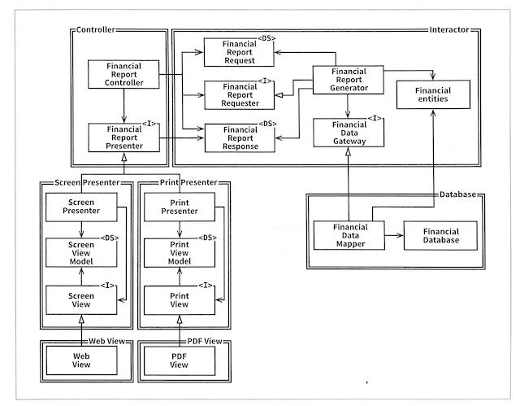
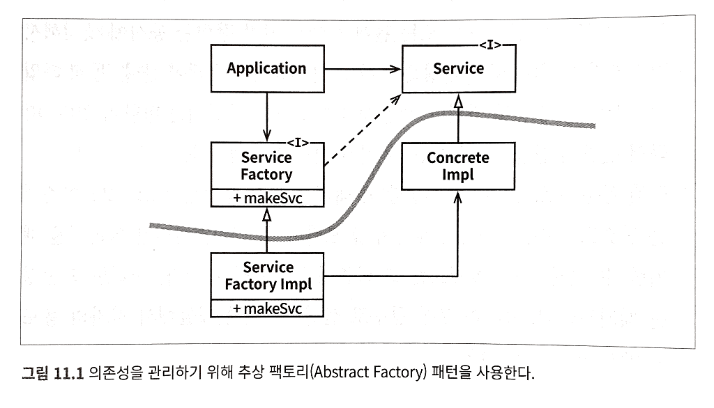

# 1장 설계와 아키텍처란?

초반 부에는 아래와 같이 다소 강한 어조의 말들이 많이 나옴. 그래서, 의구심 한 가득 안고 읽기를 시작.

> 아키텍처 규칙은 동일하다!
>
> 이 사실이 놀라운 이유는 내가 지금까지 구축한 시스템들이 근본적으로 정말 다르기 때문이다. 이토록 다양한 시스템이 왜 비슷한 아키텍처 규칙을 공유하는 걸까? 나는 소프트웨어 아키텍처의 규칙은 다른 모든 변수에 독립적이라는 결론을 내렸다.

'아키텍처 규칙'을 어떻게 정의하느냐에 따라 다를 것 같긴 한데, 개인적으로는 각 상황마다 그리고 각 소프트웨어마다 다른 목적을 가진다고 봄. 그리고 그 목적에 맞는 아키텍처의 모습은 서로 다르다고 생각. 책 나머지 부분을 읽어보고 판단하면 될 듯.

> 개발자가 속는 더 잘못된 거짓말은 "지저분한 코드를 작성하면 단기간에는 빠르게 갈 수 있고, 장기적으로 볼 때만 생산성이 낮아진다"는 견해다. (중략) 진실은 다음과 같다. 엉망으로 만들면 깔끔하게 유지할 때보다 항상 더 느리다. 시간 척도를 어떻게 보든지 관계없이 말이다.

하지만 반론할 수 있는 몇 가지 사례가 즉각 떠오른다. 게다가 책에서 근거로 드는 측정은 충분한 설득력을 가지지 못한다고도 생각함.

> 소프트웨어 아키텍처의 목표는 필요한 시스템을 만들고 유지보수하는 데 투입되는 인력을 최소화하는 데 있다.

위 내용에는 어느 정도 공감. 하지만, 아키텍처의 목적은 단순히 필요한 시스템을 만드는 게 아니라, 더 빠르고 안정적으로 만들 수 있게 해야 하며, 유지보수 비용의 절감을 넘어 사업의 성공을 돕거나 이끌 수 있어야 한다고 생각함. 유지보수 비용의 절감은 이를 돕는 하나의 수단에 불과한 것 아닐까.

# 8장 OCP: 개방-폐쇄 원칙

> 소프트웨어 개체<sup>artifact</sup>는 확장에는 열려 있어야 하고, 변경에는 닫혀 있어야 한다.

OCP 얘기가 나오면 개인적으로, 로버트 마틴의 [OCP: The Open-Closed Principle](https://drive.google.com/file/d/0BwhCYaYDn8EgN2M5MTkwM2EtNWFkZC00ZTI3LWFjZTUtNTFhZGZiYmUzODc1/view)에 있는 예제를 가장 먼저 떠올리곤 했음. 참고로, 코드는 아래와 같음.

```java
public class Drawer {
   public void draw(List<Shape> shapes) {
       shapes.forEach(shape -> {
           shape.draw();
       });
   }
}

public interface Shape {
   void draw();
}

public class Circle implements Shape {
   public void draw() {
       System.out.print("circle-draw");
   }
}

public class Rectangle implements Shape {
   public void draw() {
       System.out.print("rectangle-draw");
   }
}
```

그런데, 이번 책에 나온 예제가 더 좋다고 생각됨. 게다가 아키텍처 컴포넌트 수준도 함께 다루고 있어 더 의미있게 다가옴.

일단, 아래 그림은 SRP를 적용해 만들어진 결과물. 이렇게 하면 보고서 생성이 두 개의 책임으로 분리되고, 한 쪽 보고서의 변경이 나머지 한 쪽으로 전파되지 않음.


> 서로 다른 목적으로 변경되는 요소를 적절하게 분리하고(SRP), 이들 요소 사이의 의존성을 체계화함으로써(DIP) 변경량을 최소화할 수 있다.

분리를 했다면, 이제 의존성도 조직화해야 함. 클래스 단위에서 나아가 컴포넌트 단위의 고민도 필요. 아래 그림은 그 결과물.



위 그림에서 특징적인 부분 몇 가지 기록.

- 클래스 간의 의존성은 단방향.
- 컴포넌트(위 그림에서 이중선으로 구분됨) 간의 의존성도 단방향.
- 이로 인해, `Presenter`의 변경으로부터 `Controller`가, `View`의 변경으로부터 `Presenter`가 보호됨.
- 무엇보다 `Interactor`는 다른 모든 곳의 변경으로부터 보호됨. 상위 수준의 업무 규칙, 정책이 보호되는 것.
- `FinancialDataGateway`는 의존성 역전의 결과물.
- `FinancialReportRequester`는 `Interactor` 내부를 너무 많이 알지 않게 하기 위함. 여기서는 추이 의존성(transitive dependency) 방지. 개인적으로, 실효성에 대해서는 의문.

# 11장 DIP: 의존성 역전 원칙

## 변동성<sup>volatile</sup>

잘 변하지 않고, 의존성이 높지 않은 부분에는 추상화가 그리 필요치 않다고 생각함. 변경이 쉽기 때문. 복잡한 구조가 가져오는 비용이 더 큰 것. 물론, 그 외에도 여러 고려해야 할 요소들이 많음. 변경을 잘 하려는 이유도 궁극적으로는 어떤 목표가 있는 것. 어떤 목표에서는 A라는 요소가 중요하지만, 다른 목표에서는 그렇지 않을 수도 있음. 목표에 따른 적절한 선택이 중요.

어쨋든, 책을 읽으면서 단순히 원칙을 제시하는 부분들이 불편하고, 또 여러 생각을 하게 만들었는데, 아래 내용은 그 불편함을 어느 정도 해소시켜 줌.

> 이 아이디어를 규칙으로 보기는 확실히 비현실적이다. 소프트웨어 시스템이라면 구체적인 많은 장치에 반드시 의존하기 때문이다. 예를 들어 자바에서 String은 구체 클래스이며, 이를 애써 추상 클래스로 만들려는 시도는 현실성이 없다. java.lang.String 구체 클래스에 대한 소스 코드 의존성은 벗어날 수 없고, 벗어나서도 안 된다.
>
> 반면 String 클래스는 매우 안정적이다. String 클래스가 변경되는 일은 거의 없으며, 있더라도 엄격하게 통제된다. 프로그래머와 아키텍트는 String 클래스에서 변뎍스러운 변경이 자주 발생하리라고 염려할 필요가 없다.
>
> 이러한 이유로 DIP를 논할 때 운영체제나 플랫폼 같이 안정성이 보장된 환경에 대해서는 무시하는 편이다. 우리는 이들 환경에 대한 의존성은 용납하는데, 변경되지 않는다면 의존할 수 있다는 사실을 이미 알고 있기 때문이다.
>
> 우리가 의존하지 않도록 피하고자 하는 것은 바로 변동성이 큰<sup>volatile</sup> 구체적인 요소다. 그리고 이 구체적인 요소는 우리가 열심히 개발하는 중이라 자주 변경될 수밖에 없는 모듈들이다.

## 안정된 추상화

'안정된 추상화'라는 용어도 소개되고 있음. 용어 선정이 매우 잘 됐다고 생각함. 이에 대한 설명은 아래와 같음.

> 추상 인터페이스에 변경이 생기면 이를 구체화한 구현체들도 따라서 수정해야 한다. 반대로 구체적인 구현체에 변경이 생기더라도 그 구현체가 구현하는 인터페이스는 항상, 좀 더 정확히 말하면 대다수의 경우 변경될 필요가 없다. 따라서 인터페이스는 구현체보다 변동성이 낮다.
>
> 실제로 뛰어난 소프트웨어 설계자와 아키텍트라면 인터페이스의 변동성을 낮추기 위해 애쓴다. 인터페이스를 변경하지 않고도 구현체에 기능을 추가할 수 있는 방법을 찾기 위해 노력한다. (중략)
>
> 즉, 안정된 소프트웨어 아키텍처란 변동성이 큰 구현체에 의존하는 일은 지양하고, 안정된 추상 인터페이스를 선호하는 아키텍처라는 뜻이다.

그러면서 3가지 코딩 실천법도 소개.

1. 변동성이 큰 구체 클래스를 참조하지 말라.
2. 변동성이 큰 구체 클래스로부터 파생하지 말라.
3. 구체 함수를 오버라이드 하지 말라.

한 가지 놓치지 않았으면 하는 것이 있음. 단지 인터페이스를 추출했다고, 안정된 상태를 유지할 수 있는 것은 아님. 예컨대, 메시지를 보내는 인터페이스가 아래와 같다고 해보자.

```kotlin
interface Notifier {
    fun send(port: Int, uri: URI, message: String)
}
```

인터페이스를 만들긴 했지만, '안정된' 인터페이스라고 할 수 있을까? 만약, 메시지를 보내는 방식이 HTTP에서 큐로 바뀐다면?

## 구체 컴포넌트



위 그림에서는 `ServiceFactoryImpl`이 `ConcreteImpl`에 의존하고 있다. 그러니까 DIP 위배다. 하지만, DIP를 규칙으로 보기에는 비현실적이라고 했던 것 처럼, DIP 위배를 모두 없앨 수는 없음. 하지만, 그림에는 굵은 선으로 된 경계가 그려져 있음. 이는 DIP를 위배하는 클래스들을 시스템의 다른 부분과 분리했음을 나타냄. 게다가, 의존성은 한 쪽 방향으로만, 그러니까 추상화 된 곳으로 향하고 있음. DIP 위배를 허용하긴 하지만, 그 범위와 의존성을 적절히 제한하고 있는 것.

# 13장 컴포넌트 응집도

응집도와 관련된 3가지 컴포넌트 원칙 이야기

## REP: 재사용/릴리스 등가 원칙

> 재사용 단위는 릴리스 단위와 같다.

- Reuse/Release Equivalence Principle
- 릴리스 번호가 없다면 재사용 컴포넌트들이 서로 호환되는지 보장 X.
- 새로운 버전이 언제 출시되고 무엇이 변했는지를 사용자들이 알아야 하기도 함.
- 컴포넌트가 릴리즈 절차를 제대로 밟는다면, 재사용을 효율적으로 할 수 있음.

## CCP: 공통 폐쇄 원칙

> 동일한 이유로 동일한 시점에 변경되는 클래스를 같은 컴포넌트로 묶어라. 서로 다른 시점에 다른 이유로 변경되는 클래스는 다른 컴포넌트로 분리하라.

- Common Closure Principle
- 코드가 변경되어야 할 때, 여러 컴포넌트를 함께 수정하기 보다는, 하나의 컴포넌트만 수정할 수 있는 것이 나음.
- 릴리즈, 재검증, 배포 관련된 일의 범위를 제한할 수 있기 때문.
- CCP는 이를 돕는 원칙.
- 일반적으로 유지보수성이 재사용성보다 훨씬 중요.

## CRP: 공통 재사용 원칙

> 컴포넌트 사용자들을 필요하지 않는 것에 의존하게 강요하지 말라.

- Common Reuse Principle
- 재사용하는 컴포넌트가 바뀐다면, 클라이언트 측도 함께 바꿔야 할 가능성이 높음.
- 문제는 실제로는 쓰이지 않는 부분이 바뀌었다고 하더라도, 컴파일이나 테스트 등의 검증 및 재배포를 해야 할 수도 있음.
- 강하게 결합되지 않은 클래스들을 동일한 컴포넌트에 위치시키지 않아야 함.
- 불필요한 변경에 우리의 노력을 허비할 수도.
