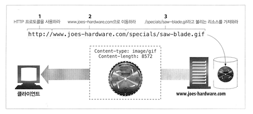

# HTTP 개관

-  웹 클라이언트와 서버 기본 동작
   -  `http://www.oreilly.com/index.html` 페이지를 열어볼 때,
   -  웹 브라우저는 HTTP를 사용하기로 결정한 뒤,
   -  `www.oreilly.com` 서버로 요청을 보냄.
   -  서버는 요청 받은 객체인 `/index.html`을 찾고,
   -  성공하면 타입과 길이 정보와 함께 HTTP 응답으로 반환.

-  미디어 타입 (MIME)
   -  메일의 MIME 방식을 채택해 미디어 타입을 제공.
   -  주 타입primary object type과 부 타입specific subtype으로 이루어짐.
-  URI
   -  Uniform Resource Identifier의 약어.
   -  정보 리소스를 고유하게 식별하고 위치를 지정할 수 있음.
   -  결국 클라이언트가 관심 있는 리소스를 쉽게 지목 가능.
   -  URL과 URN이 존재함.
-  메시지
   -  시작줄, 헤더, 본문으로 이루어짐.
   -  시작줄에는 요청의 경우 무엇을 해야 하는지, 응답의 경우 무슨 일이 일어났는지를 명시함.
   -  헤더는 0개 이상의 헤더 필드로 이루어짐.

-  브라우저가 멀리 떨어진 서버의 리소스를 사용자에게 보여주는 과정.
   -  서버의 URL에서 호스트 명 추출.
   -  서버의 호스트 명을 IP로 변환.
   -  URL에서 포트 번호 추출.
   -  웹 서버와 TCP 커넥션 연결.
   -  서버에 HTTP 요청 전달.
   -  서버로부터 HTTP 응답 수신.
   -  커넥션이 닫히면 브라우저에 문서를 보여줌.
-  웹의 구성요소
   -  프록시: 클라이언트 요청을 서버에 전달하는 중재자. 주로 보안 목적. 애플리케이션 통합, 성능 최적화 등에도 사용됨.
   -  캐시: 프록시에서 자주 찾는 것들을 저장하는 특수한 프록시. 성능 목적.
   -  게이트웨이: HTTP 트래픽을 다른 프로토콜로 변환. HTTP 요청을 받아 FTP로 변환하는 등.
   -  터널: 두 커넥션 사이의 데이터에 관여치 않고 그대로 전달. 대표적으로, SSL 요청을 받아 뒷 단의 서버에 HTTP로 전달.
   -  에이전트: 설명 생략.

