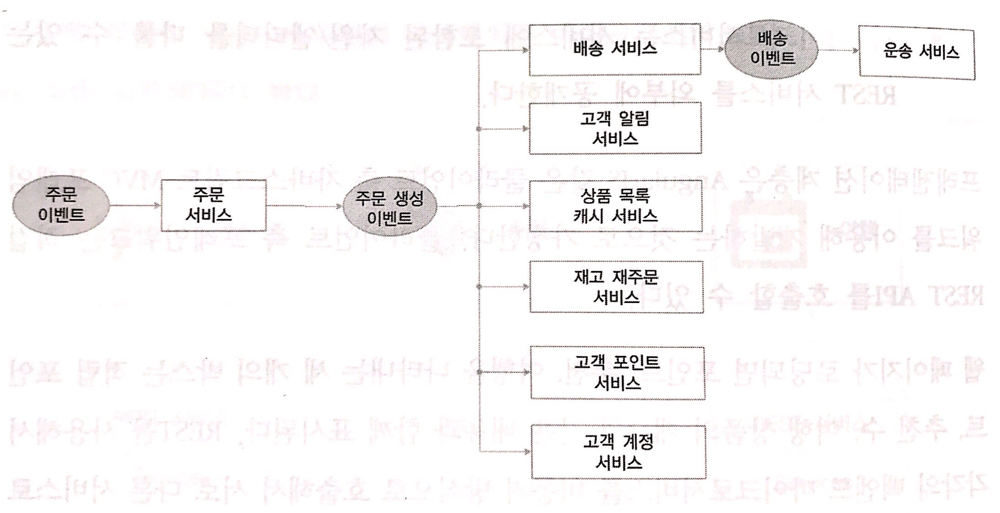
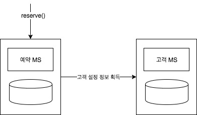
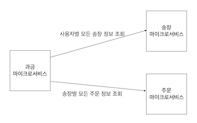

# 책소개

라제시 RV(Rajesh RV), [스프링 마이크로서비스](http://www.acornpub.co.kr/book/spring-microservices)

# Demistifying Microservices
기술적 매력이나 한계가 아닌, "비즈니스적 요구"로 책을 시작하는 것이 인상깊음. 아래 문장도 흥미로움.

> 많은 조직들이 고객을 사로잡는 핵심 비즈니스 애플리케이션에만 마이크로서비스를 사용하고, 나머지는 기존의 레거시 일체형 애플리케이션을 그대로 두는 방식을 취하기도 한다는 점도 기억해둘만 하다.

아래 그림은 마이크로서비스의 한 예시.

1. 주문 이벤트 접수되면 `주문 서비스`에서 먼저 처리되고, 주문 상세 정보다 데이터베이스에 담김.
2. 주문 저장이 성공하면 `주문 생성 이벤트`가 발생함.
3. `주문 생성 이벤트`는 순차 혹은 병렬적으로 다른 서비스들에 의해 처리됨.
4. `배송 서비스`는 `주문 생성 이벤트`를 받아, 고객에게 배송하기 위한 기록을 남긴 후 `배송 이벤트`를 전파.
5. `운송 서비스`는 `배송 이벤트`를 받아 운송 계획 생성함.
6. `고객 알림 서비스`는 주문 결과를 고객에게 이메일, 문자 등으로 알림.
7. `상품 목록 캐시 서비스`는 주문 후 남아 있는 상품 개수를 갱신함.
8. `재고 재주문 서비스`는 재고를 조사하고 필요하다면 `재고 고갈 이벤트`를 생성함.
9. `고객 포인트 서비스`는 구매로 발생한 적립 포인트를 누적시킴.
10. `고객 계정 서비스`는 고객 계정의 주문 이력을 업데이트.

마이크로 서비스 적용하기에 좋은 경우와 그렇지 않은 경우도 이야기함. 요약하면 아래와 같음.

1. 수명이 다한 무거운 레거시 재작성. 전부 새롭게 만드는 대신, 점진적으로 하나씩 이관함. 비즈니스 위험을 분산시킬 수 있음.
2. 독립적인 무상태 컴퓨팅 단위. 최적화, 예보, 가격 산정, 제안, 암호화, 인증 서비스 등이 해당함.
3. 재사용 단위. 결제, 로그인, 고객 프로파일, 알림 서비스 등.
4. 빠른 변경과 배포 속도가 필요하거나, 실험적인 애플리케이션도 대상.
5. 비즈니스 로직을 ESB와 같은 무거운 중앙 집중적 컴포넌트에서 관리해야 하는 경우는 적합치 않음.
6. 조직의 문화가 폴포수 모델이거나 무거운 출시 절차 등을 가지거나, 인프라스트럭처 자동 구성 부재 등의 경우도 적합치 않음.

# Applying Microservices Concepts

## Patterns and common design decisions

### Establishing appropriate boundaries

> 많은 조직에서는 비즈니스 본연의 성격보다는 서비스 제공 채널에 바탕을 두고 조직을 구성한다. 이런 경우라면 조직도는 서비스 경계에 대한 정확한 정보를 제공해 주지 못한다.

- Autonomous Functions
  - 외부 기능에 대한 의존도가 낮아, 입력을 받으면 내부 로직과 데이터로 결과 반환 가능함.
  - 암호화 엔진, 알림 엔진, (주문을 받아 처리하고 운송 서비스에 알려주는) 배송 서비스, (좌석 현황 정보를 캐시해 서비스하는) 온라인 항공편 검색 기능.
- Size of deployable unit
- Polyglot architecture
  - 다양한 비기능/기능적 요구 사항을 충족시키기 위한 고유 기술 선택.
  - 예약은 ACID 준수하는 MySQL 사용. 검색은 Cassandra 같은 NoSQL 사용.
- Selective scaling
  - 예컨대, 예약 시스템에서 요청의 절반을 차지하는 검색을 분리.
- Single Responsibility
- Replicability or changeability
- Coupling and cohesion
  - 가장 중요한 요소.
  - 기능 분해도나 의존 관계 트리가 도움이 됨.

### Designing communication styles

#### Synchronous

- 공유 메시지 서버 같은 인프라 관리 비용이 없음.
- 어떤 단계에서 에러가 발생해도 데이터 일관성 보장.
- 불필요한 대기 시간이 발생하기도 함.
- 고정적인 의존 관계가 명시됨.
- 하나의 서비스 체인 문제가 전체로 이어지기도 함.
- 실패 시나리오의 많은 부분은 타임아웃 및 이벤트 루프로 해결 가능.

#### Asynchronous

- 동기 방식에 비해 더 고수준의 확장성 제공.
- 특정 서비스의 문제가 전체로 이어질 가능성 낮아짐(비동기 방식에서도 [Catastrophical Failover](https://martinfowler.com/bliki/CatastrophicFailover.html)는 발생함).
- 외부의 메시징 서버에 의존하게 됨.
  - 메시징 서버가 장애를 견딜 수 있게 하는 것은 쉽지 않음.
  - 메시징은 활성/비활성 기준으로 동작. 그래서 지속적 가용성 확보가 쉽지 않음.
  - 일반적으로 영속성을 사용하므로, 더 높은 수준의 I/O 처리와 튜닝이 필요함.

비동기 방식 중에서 잘 이해 안되는 부분이 있음.

> 이 방식에서는 서비스가 독립적이고, 요청을 처리하는 스레드를 내부적으로 재생산해서 부하의 증가를 처리할 수 있기 때문에 더 고수준의 확장성을 제공한다.

여기서 `요청을 처리하는 스레드를 내부적으로 재생산해서 부하의 증가를 처리`의 의미는 Non-Blocking을 의미하는가 싶다.

#### Which style to choose

아래 문장이 내용을 대표한다고 생각함.

> 일반적으로 마이크로서비스 세상에서는 비동기 방식이 더 나은 경우가 많지만, 장단점을 잘 따져서 적합한 패턴을 선별하는 것이 중요하다. 비동기 방식의 트랜잭션이 아무런 장점이 없어 보이는 비즈니스라면 비동기 방식의 장점이 보일때까지 동기 방식을 사용하면 된다.

- 고객의 정보를 단순히 DB에서 가져오는 데 비동기를 사용하는 경우가 잘못된 사례로 소개됨.
- 방식은 비동기지만 사용자에게 결과를 보여주기 전까지는 결국 블럭되어 대기하게 됨.
- 참고로, 리액티브 프로그래밍은 비동기 방식의 복잡성을 다룰 수 있도록 도와줌.

### Orchestration

- **Composability** ∈ { **Orchestration**, **Choreography** }
- 마이크로서비스는 자율적. 기능이 실행되는 데 필요한 모든 컴포넌트가 서비스 내에 존재.
- 이벤트(메시지)의 소비는 소비자 스스로 결정.

여기까지는 어찌보면 뻔한 내용. 하지만 뒤이어 현실적인 내용이 언급됨. 이 책의 전반적 장점 중 하나.

> 하지만 모든 사례에 대해 연출 방식으로 모델링하는 것은 불가능하다

아래 그림은 예약 진행을 위해 고객 정보를 획득해야 하는 경우.

1. 동기적 호출도 한 가지 방법
2. 고객 MS를 예약 MS로 이동. 교류가 필요 없어짐. 이런식이면 또 다른 일체형이 만들어질 수 있음.
3. 비동기적 호출. 하지만 고객 정보를 얻어야 예약 진행이 가능하므로, 의미가 없음.
4. 오케스트레이션 부분만을 담당하는 MS 추가. 자율적이지 않은 MS들. 너무 잘게 나눠진 MS 가능성들.
5. 고객 설정 정보 복사본을 예약 MS에 두기. 빈틈없는 분석 선행되야 하고, 결국 복잡도가 높아짐.

### Data stores share

> 처음에는 좋을 수도 있지만, 복잡한 마이크로서비스를 개발하다 보면 데이터 모델 사이에 계속 관계를 추가하고, 조인 쿼리를 만들어내게 된다. 이는 단단하게 결합된 물리 데이터 모델이 될 수도 있다.

일반적인 DB 분리의 이야기. 더불어 아래의 내용도 함께 언급.

> 서비스가 많지 않은 수의 테이블만 갖고 있다면 오라클 데이터베이스 인스턴스와 같은 전체 DB 인스턴스를 사용하는 것은 낭비에 가깝다. 그런 경우에는 스키마 수준의 분리만으로도 시작하기에는 충분하다.

### Transaction boundaries

Eventual Consistency를 적용하여 오버헤드를 줄이곤 한다. 이 경우 문제될 수 있는 부분과 각각의 해결책 언급.

1. 남아 있는 호텔 방 1개를 3명의 사용자가 동시에 예약 시도하는 경우
   - 해결책만 언급됨. 문제는 소개되지 않음.
   - 예약 가능한 방이 없는 경우는 `예약 확정 대기`라는 상태를 둠.
   - 비즈니스 모델 자체를 바꾸는 경우 문제가 쉬워지는 사례라고 함.
2. 하나의 트랜잭션으로 묶인 여러 데이터를 다루는 경우
   - NoSQL에서는 모든 데이터를 JSON으로 한 곳에 입력.
   - 명시적인 트랜잭션 경계가 필요 없음.
3. 비행기 예약 요청(A 서비스)에서 휠체어 예약(B 서비스) 메시지 전송 후, 비행기 예약이 실패하는 경우
   - 가능한 휠체어 예약 메시지 전송을 뒤로 미룸.
   - 그럼에도 불구하고 비행기 예약이 실패하는 경우는, 휠체어 예약을 취소해 달라는 후처리 필요함.

### Endpoint design

다른 내용이 아닌, 계약 설계Contract Design 내용만을 정리함.

- 가장 중요한 것은 단순함. **KISS**, **YAGNI**.
- **CDCConsumer Driven Contract**
  - 클라이언트가 그들의 기대를 테스트 케이스로 만들어 프로바이더에게 제공함.
  - 프로바이더들은 계약이 변경될 때 마다 이 테스트 케이스를 수행하여 영향 범위를 확인함.
- **Postel's Law**도 언급되지만, KISS와 YAGNI 뒤에 언급되고 있음에 유의.

### Shared libraries

- 서비스 간에 중복된 기능이 존재할 수 있음.
- 여기서는 적격성 검사 규칙(Eligibility Rules)을 사례로 들고 있음.
- 한 가지 방법은 마이크로서비스를 추가하는 것.
- 하지만 의존관계가 하나 추가되며, 서비스 출시 관리나 성능 면에서 부정적.
- 한 가지 대안은 라이브러리를 복제하는 것.
- 요소 기술을 다루는 라이브러리나 기능 컴포넌트로 한정하고 있음에 유의.

### Versioning

- 서비스 진화를 돕는 요소로써, 미리 고려해야 하는 사항.
- 시맨틱 버전이 널리 사용됨.
  - 메이저, 마이너, 패치로 구성.
  - 메이저: API 호환이 안 될 수도 있는 대규모 변경.
  - 마이너: 하위 호환을 유지하는 한도 내에서의 변경.
  - 패치: 하위 호환을 유지하는 버그 수정.
- 서비스 버저닝은 불변 서비스immutable service의 의미

> 서비스 버전 번호는 서비스 내의 단위 기능 수준에서 적용하는 것보다 서비스 수준에서 적용하는 것이 언제나 더 간단하다. 단위 기능이 변하면 단위 기능의 버전을 V2로 하는 것보다, 서비스의 버전 번호를 V2로 하는 것이 관리하기 좋다.

그런데, 어떤 면에서 관리하기 좋다고 하는 것인지 궁금. 하나의 기능 변화로 버전 전체를 올려야 한다면, 그 만큼 코드 작업을 해줘야 함. 이 비용을 넘어서는 이점이 무엇일까?

### Shared reference data

여러 마이크로서비스에서 공유하는 레퍼런스(혹은 마스터) 데이터를 어떻게 관리할 것인가?

1. **hardcode**: relatively static, never chaning data
2. **microservice**: 별도의 마이크로서비스로 분리
   - "good, clean, and neat"이라고 표현함.
   - 다만, 각 서비스들에서 여러 번 호출될 수 있음.
3. **replication**: 각 서비스들이 데이터를 복제해서 소유함.
   - 변경이 발생하면, 다른 서비스들에도 반영.
   - "extremely performance friendly"
   - 모든 서비스에서 데이터를 동기화하는 것의 부담.
   - 코드 베이스와 데이터가 단순하거나, 데이터가 비교적 정적인 경우에 적합.
4. **cache locally**: 로컬에 캐시하여 소유. 마스터 데이터를 많은 수의 서비스가 의존하는 경우 많이 사용됨.

### Bulk operation

서로 다른 서비스의 데이터 스토어에서 조인 SQL을 사용할 수 없음. 대신, 다른 마이크로서비스로의 요청이 너무 많아짐.

두 가지 대안.

1. **pre-aggregation**
   - 주문 생성시 과금 마이크로서비스에 이벤트 발송됨.
   - 과금 마이크로서비스는 월별 정산을 위해 내부적으로 데이터를 집계.
   - 외부로 요청 보내지 않아도 됨.
   - 데이터 중복은 단점.
2. **batch API**
   - 첫 번째 방식이 어려운 경우에 사용.
   - 제목만 보면 이해가 되지만, 내용을 보면 오히려 이해 안됨. 원서를 봐도 마찬가지.

## Challanges

### Data island

- 각각의 서비스가 서로 다른 형태(ElasticSearch, Neo4j 등)로 데이터를 저장.
- 이를 조합해서 데이터를 분석해야 하려면 어떻게 해야 하는가.
- 여기서는 데이터 호수data lake를 언급.
- 어떤 데이터가 처리되면 이벤트를 발생시켜 호수에 전파.
- 전통적 데이터 웨어하우스와는 다르게, 데이터가 어떻게 사용될지에 대한 아무런 가정 없이 있는 그대로 저장.
- BI 툴에서 표현할 데이터는 이런 데이터 호수 개념을 활용하면 어떨까 함.

### Testing

- 의존 서비스의 가상화 혹은 모킹mocking
- 깊은 의존 관계가 형성된 경우 위 방식으로는 한계.
- 서비스 사용자 주도 계약consumer driven contract가 하나의 대안.
- 그 외 테스트 자동화, 성능 테스팅, A/B 테스팅 미래 깃발future flag, 카나리아 테스팅, 블루/그린 배포, 레드/블랙 배포를 언급.

# Microservices Evolution – A Case Study

여기서부터는 번역서 내려 두고, 원서만 읽음. 잘못된 정리 가능성에 유의.

3장에서 언급됐던, 마이크로서비스가 갖추어야 하는 기능capabilities 모델 그림이 다시 소개됨. 기능들을 크게 4가지로 분류하는 것이 흥미롭고, 각각의 항목들을 현재 담당하는 서비스와 비교하는 것도 재미있음. 글로 간단히 정리.

**Core Capabilities**

User Interfaces, API Gateway, Service Endpoints & Communication Protocols, Business Capability Definitions, Event Source, Storage Capabilities: Physical / In-Memory, Service Listener: HTTP / Message

**Supporting Capabilities**

Software Defined Loadbalancer, Central Log Management, Service Registry, Monitoring & Dashboards, Security Service, Dependency Management, Configuration Service, Data Lake, Testing Tools, Reliable Messaging

**Infrastructure Capabilities**

Private/Public Cloud (IaaS), Container/Virtual Machine, Cluster Control & Provisioning, Application Lifecycle Management

**Process & Governance Capailities**

DevOps, DevOps Tools, Microservices Repository, Reference Architecture & Libraries

## Unerstanding the PSS application

PSS라는 가상의 항공편 제공 시스템을 사례로 들고 있음. 사례 살펴보기에 앞서, 시스템을 기능적 측면과 아키텍처 측면으로 간략히 소개함. 그중에서 기능적 측면을 관심 있게 살펴봄. IT 서적들은 주로 기술적 어려움만을 다루기 때문임. 비록 아주 간단하게 설명하고 있지만, 이마저도 반가움.

1. **Search**: Search, Flight, Fare
2. **Reservation**: Book, Inventory, Payment
3. **Check-in**: Check-in, Boarding, Seating, Baggage, Loyalty
4. **Back Office**: CRM, Data Analysis, Revenue Management(Fare calculation based on forecasts), Accounting (Invocing and Billing)
5. **Data Management**: Reference Data, Customer
6. **Cross Cutting**: User Management, Notification

개인적으로는 Data Management, Reference Data의 명칭과 분류가 아쉬움.

## Death of the monolith

처음엔 잘 동작하지만, 사용량이 많아지면서 생기는 모놀리스의 문제들을 소개.

### Pain Points

1. 안정성Stability
   - DB 테이블 락 -> 스레드 잠식stuck threads -> 요청 처리 능력 제한
   - 메모리 이슈
   - 리소스 사용이 많은 동작들
2. 정전Outages
   - EAR 크기 증가 -> 서버 시작 시간 증가 -> 정전 시간 증가 -> 정전 사이에 쌓인 메시지로 인해, 서버 시작 직후 부담 증가
   - 작은 변화에도 전체 배포
   - 무중단 배포의 복잡성 + 서버 기동 시간 -> 정전 수와 시간 증가
3. 민첩성Agility
   - 변화를 구현해 내는 역량의 부족 등 다양한 이유로 코드 복잡성 증대 -> 분석 어려움 -> 동작하는 코드를 깨뜨림. 잦은 픽스 -> 변화 어려움.
   - 빌드 시간 증대 -> 개발 생산성 하락, 빌드 자동화와 단위 테스트 등을 어렵게 만듦.

### Stop gap fix

제목을 어떻게 번역했을지 궁금. 어떻게든 되게 하려는 임시 방편적 처리를 멈추라는 의미로 다가옴.

1. 스케일 업으로 일부 문제들 해결
2. 하지만 곧 스케일 아웃 진행
3. 얼마 지나지 않아 DB가 병목이 됨
4. Oracle의 RAC를 통해 해결
5. 하지만 복잡성과 소유 비용cost of ownership(?) 증가
6. 기술 부채 역시 지속적으로 증가
7. 재작성만이 이를 해결할 수 있는 수준이 됨

### Retrospection

왜 잘 설계된 어플리케이션이 실패했을까?

**SHARED DATA**

1. 거의 모든 기능 모듈들이 필요로 하는 참조 데이터들이 있음. 도시, 나라, 환율, 비행기 등.
2. 이들을 각각의 독립적인 서브시스템으로 나눌 수 있음. 하지만 성능 이슈.
3. 공유 라이브러리로 이 참조 데이터들을 사용하기로 함.
4. JPA의 엔티티 관계를 생각하면 됨.

**SINGLE DATABASE**

1. 하지만 결국은 하나의 DB를 사용함.
2. JDBC SQL들을 직접 사용하면 좋은 성능을 얻을 수 있음.
3. 서로 다른 서브시스템들이 소유한 DB 테이블들을 직접 참조하기 시작함.
4. 예를 들어, N+1 문제를 피하기 위해 타 시스템 테이블들을 직접 참조하여 조인함.
5. 시스템 간의 강결합이 되고, 문서화도 되지 않으며, 발견하기도 어려움.
6. 이는 Native queries에 대한 이야기이며, Stored procedures도 마찬가지.

**DOMAIN BOUNDARIES**

1. 도메인 간의 경계가 잘 설정되어 있긴 하지만, 모두 EAR 파일 하나로 패키징 됨.
2. 빠른 배포 압박과 복잡성 증대 등의 이유로 개발자들은 쉽고 빠른 해결책들을 쫓게 됨.
3. 원래의 의도와는 다르게 모듈간의 결합도가 점점 높아짐.

## The business case

마이크로서비스에서는 모놀리스 방식에서의 이슈들을 어떻게 극복하는가? 1장에서 충분힌 소개되었지만, 지금 사례에서 중요한 4가지를 다시 언급.

1. **서비스 의존성**: 마이크로서비스로 전환하면서 의존성들이 드러나게 됨. 더 나은 시스템 설계에 도움이 됨.
2. **물리적 경계**: 물리적인 수준으로 경계가 나눠짐. 심지어 기술 스택이 다를 수 있음. 강결합을 더 적극적으로 피할 수 있음.
3. **선택적 확장**: Y-scale 접근법에 비해 좀 더 cost-effective scaling 가능함.
4. **기술 노후화**: 기술 전환의 단위가 작아짐. 좀 더 쉽고 빠르게 전환 가능함.

## Plan the evolution

### Evolutionary approach

- 점진적인 접근 방식을 사용하자는 이야기.
- [Strangler Application](https://www.martinfowler.com/bliki/StranglerApplication.html)이 생각남.

### Identification of microservices boundaries

#### ANALYZE DEPENDENCIES

여러가지 툴을 이용해 기존 시스템의 의존성 그래프를 그려낸 후, 불필요한 의존성을 줄이고, 좀 더 리액티브한 방식으로 바꿔나감.

1. **Events as opposed to query**

   - 일반적으로 이벤트 방식이 일반적으로 약결합이고, 유연하며, 스케일링에 유리.
   - 쿼리 방식은 이벤트 방식으로 변경이 가능.
   - 하지만, 실제로 필요한 데이터에 비해 너무 많은 데이터가 구독되는 것은 낭비.
   - 마찬가지로, 아주 가끔 필요한 데이터인데, 상시로 구독되는 것 또한 낭비.
   - 두 방식의 혼용도 가능함. 예컨대, 24시간 동안 이뤄지는 `Check-In` 모듈은 체크인이 열릴 때, `Booking`으로부터 관련된 정보를 가져오고, 이후에는 변경된 내용만을 `Booking`으로부터 구독.

2. **Events as opposed to synchronous updates**

   - 동기적 업데이트 방식 또한 이벤트로 변경 가능.

3. **Challenge requirements**

   - `Flight`에 대한 `Book`과 `Search`의 의존성을 사례로 들고 있음.
   - 사용자들이 항공편을 예약하거나 검색하려고 할 때, 특정 항공편이 유효한지를 검사해야 함.
   - 매번 `Flight`에게 비행기가 유효한지, 해당 날짜에는 이용 가능한지 등을 물어볼 수도 있음.
   - 반면, `Flight` 서비스에서 유효성 여부에 따라 재고inventory를 0으로 만들 수도 있음.
   - `Book`과 `Search`는 이 재고만 보면 됨.

4. **Challenge service boundaries**

   - `Book`, `Search`, `Inventory`에 대한 얘기만 기록함.
   - `Inventory`와 `Search`는 `Booking`만을 지원하는 서비스.
   - business capability만 보면 `Booking` 내부로 이동하는 것이 이상적으로 보임.
   - 이 3개의 서비스를 합쳐서 `Reservation`이라는 서비스를 만듦.
   - 하지만 어플리케이션의 통계를 보면, 검색 트랜잭션이 예약의 그것에 비해 10배가 넘음.
   - 이런 이유로 서로 다른 스케일링 모델이 필요.
   - 또한, 검색은 안되더라도 예약은 되야 함. 검색의 트랜잭션 증대가 예약에 영향을 미치면 안됨.
   - 이것이 폴리글랏 요구사항의 한 사례.
   - 따라서, `Search`는 `Booking`으로부터 분리.
   - 하지만 이렇게 되면, `Search`는 다시 재고 조회를 위해 `Inventory` 즉, `Reservation`에 의존.
   - 이는 예약 트랜잭션에 영향을 미칠 수 있다는 이야기.
   - 저자가 제시하는 방법은 Inventory slave copy (read-only)를 Search 내부에 두는 것.

   

### Prioritizing microservices for migration

어떤 것을 먼저 마이크로서비스로 이관해야 할까? 이를 결정하기 위해, 몇 가지 고려할 요소들이 있음.

-  **Dependency**: 의존성이 적을수록 쉬움.
-  **Transaction volume**: 요청량이 많을수록 기존 시스템에 부하를 덜어줌. 하지만 위험.
-  **Resource utilization**: 리소스 사용량이 많을수록 기존 시스템 부하 경감.
-  **Complexity**: 복잡도 적을수록 쉬움.
-  **Buisiness criticality**
-  **Velocity of changes**: 변경이 많이 일어나는 서비스를 먼저.
-  **Innovation**: 기존 시스템에서 하기 어려운 혁신적인 기능이나 프로세스를 먼저.

### Data synchronization during migration

-  일정 기간 동안 신규와 레거시 시스템이 공존하면서, 데이터 동기화도 필요함.
-  가장 쉬운 방법으로는 DB 수준의 동기화 툴을 이용하는 것. 
-  하지만, 서로 다른 DB 기술이 사용되면 복잡해짐.
-  또한, backdoor entry 허용시, 외부에 내부 데이터 소스가 노출됨.
-  다른 방법으로, 레거시 시스템에서 데이터 변경이 발생하면 이를 신규 시스템에 이벤트로 전파. 그리고 동기화.
-  좀 복잡한 케이스 설명도 하고 있음. 하지만 특별해 보이지는 않음. 상황에 맞게 여러 방안이 필요하다는 이야기.

### Managing reference data

이미 3장의 "Handling shared Reference Data"에서 다룬 내용. 여기서 레퍼런스 데이터란, 여러 서비스들에서 공통적으로 사용되는 데이터로, 주소, 비행기 스케쥴, 예약 정보 등을 가리킴.

1. 1안
   - 공통으로 사용되는 데이터들을 별도의 마이크로서비스를 만들어 제공할 수 있음.
   - 구조적으로는 좋을지 모르나 성능 문제를 야기함.
2. 2안
   - 레퍼런스 데이터들을 마이크로서비스로 제공.
   - 그리고 각 서비스 안에 레퍼런스 데이터 캐시를 둠.
   - 점진적으로 더 많은 데이터들이 마스터 서비스로부터 캐시됨.
   - 가벼운 프록시 라이브러리를 두어, 데이터가 원격 서비스에서 오는지 캐시로부터 오는지를 추상화.
   - 이 경우 마스터와 슬레이브 간의 데이터 동기화 노력이 필요. 변경된 데이터에 대한 구독도 필요함.
3. 3안
   - 2안에서의 로컬 캐시를 in-memory data grid로 대체.
   - 레퍼런스 데이터 서비스는 in-memory data grid에 데이터를 write.
   - 각 서비스의 프록시 라이브러리들은 읽기 전용 API만을 가짐.
   - 데이터 구독이 필요 없고, 효율적이며 일관성 있음.

### User interfaces and web applications

MSA 전환 기간 동안, 이전의 사용자 인터페이스와 새로운 것을 같이 유지해야 할 수 있음. 방안으로 3가지를 제시.

1. 레거시와 신규는 서로 다른 독립된 어플리케이션. 하지만, 이것이 가능한 비즈니스 상황은 거의 없을 것.
2. 레거시 UI를 우선적으로 제공하되, 사용자가 새로운 어플리케이션의 페이지를 요청한 경우 페이지 컨트롤을 새로운 어플리케이션으로 넘겨주기. 사용자에게는 좀 더 부드러운 경험 제공(?). 하지만 SSO 등이 필요.
3. 레거시 UI가 새로운 마이크로서비스 백엔드를 바라봄. 레거시 UI가 요구하는 것에 따라 도전적일 수 있음.

#### SESSION HANDLING AND SECURITY

신규와 레거시 UI가 공존하고, 신규 인증 서버가 토큰 기반 인증 전략과 함께 Spring Security를 사용하는 경우를 예로 들어 설명함. 특별한 것 없어 보임.

### Test strategy

- 신규로 전환하기 전에 레거시에 대한 통합 테스트 케이스가 있어야 함.
- 그리고 신규로 전환 후 기존의 테스트 케이스가 통과하는지 여부 확인.
- 이는 이관하기 전과 후의 동작이 동일한지를 어떻게 보장하느냐에 대한 대답.

### Building ecosystem capabilities

- 모든 마이크로서비스 capability model이 준비되어 있어야 함.
- 이들 외에도 레퍼런스 데이터, 보안, SSO, 고객, 알림 등의 기능 구축 먼저 필요.
- 효과적 접근 방법은, 가능한 이런 기능 구현을 필요 시점까지 미루기.