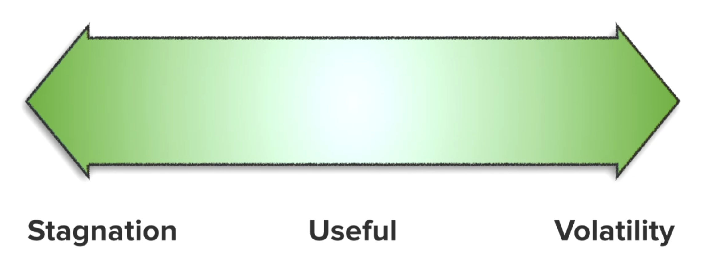

# 12/01

## JOOQ Record to POJO Mapping

- Type-Safe SQL 작성에 JOOQ를 사용 중.
- JOOQ의 select로 얻어낸 데이터를 POJO(도메인 모델)로 변환해서 사용하는데,
- JOOQ 또는 써드 파티들이 제공하는 것들이 많은 한계를 가짐.
- (가능한 피하는 방식이긴 하지만) 결국 직접 매핑 라이브러리를 작성.
- 잘 사용하고 있었으나, 성능 문제로 Performance Critical 부분에는 적용 X.
- 적용이 필요한 시점이 되어, 결국 성능 개선 작업을 진행. 약 2배 정도의 TPS 향상.
- 배포는 하되 [Feature Toggle](https://martinfowler.com/articles/feature-toggles.html)을 적용. 언제든 기존 알고리즘이 새로운 알고리즘을 대체할 수 있도록 함.
- [관련된 내용은 블로그에 정리](http://codehumane.github.io/2017/12/04/JOOQ-to-POJO-Mapping/).

# 12/04

## Book

- 알고리즘
  - 그래프의 분할(decompositions of graph), [왜 그래프인가](https://github.com/codehumane/what-i-learned/blob/master/algorithm/decompositions-of-graph.md)

# 12/05

## URI, URL, URN

- 매번 헷갈리는 대상. 설명은 [여기](https://stackoverflow.com/questions/176264/what-is-the-difference-between-a-uri-a-url-and-a-urn) 잘 나와 있음.
- 더불어, URI의 구성요소도 궁금했고, 간단히 아래처럼 코드로 확인.

```java
@Test
public void uri() throws Exception {
    final URI uri = URI.create("https://www.aaa.com:8080/bbb?ccc=ddd#eee");
    log.info(uri.getAuthority()); // www.aaa.com:8080
    log.info(uri.getFragment()); // eee
    log.info(uri.getHost()); // www.aaa.com
    log.info(uri.getPath()); // /bbb
    log.info(uri.getQuery()); // ccc=ddd
    log.info(uri.getScheme()); // https
    log.info(uri.getPort()); // 8080
}
```

# 12/07

## Zuul-Ribbon ReadTimeout

- 오늘 A라는 서비스를 배포함.
- 이 배포에는 새로 추가된 API 엔드포인트가 있었는데, 기존의 것들에 비해 느렸음. 
- 부하 테스트를 통해 인지하고 있었지만, 영향범위 분석해서 감안하고 배포한 것.
- 하지만 API Gateway(Zuul)의 A 서비스에 대한 `ReadTimeout`을 고려하지 못함.
- 이따금 이 임계치를 넘는 요청 지연이 있었고, 이로 인해 `503(Service Unavailable)`이 발생.
- 즉시 대응으로, 새로운 기능에 대해 Feature Toggle을 Off 시킴.
- 그리고 `ReadTimeout` 늘린 후, 다시 Feature Toggle On.
- 향후 대응으로, 배포를 준비하고 있던 성능 개선 작업을 가능한 빠르게 배포할 예정.
- 그럼에도 불구하고 기존 엔드포인트만큼의 성능을 보장하지 못한다면, A 서비스에 대한 Zuul의 논리적 의존성을 분리.
- 이런 저런 것들을 많이 느낀 배포였음.

# 12/10

## Graph Depth-First Search

- [오랜만에 다시 구현](https://github.com/codehumane/learn-algorithm-in-java/commit/584463868529cde41f8001f7096b2aba2a124c80).
- 그리고 기본적인 것 이외에 여러 가지 활용이 있다는 것을 알게 됨.
- 그 활용은 [여기 작성](https://github.com/codehumane/learn-algorithm-in-java/commit/5d495acaa75c0f6baa460d973321f40533141975)한 `previsit`, `postvisit` 처리로 가능함.
- 그리고 [이건](https://github.com/codehumane/learn-algorithm-in-javascript/blob/master/test/algorithm/graph.spec.js) 예전에 작성해 본 JavaScript 버전.
- [유향 그래프<sup>Directed Graph</sup>에 대한 깊이 우선 탐색도 작성](https://github.com/codehumane/learn-algorithm-in-java/commit/940fde15d8b475a99bd8c0de10315bcd2c2038ea)해 봄.

## Java Map Interfaces

- [putIfAbsent](https://docs.oracle.com/javase/8/docs/api/java/util/Map.html#putIfAbsent-K-V-), [computeIfAbsent](https://docs.oracle.com/javase/8/docs/api/java/util/Map.html#computeIfAbsent-K-java.util.function.Function-), [computeIfPresent](https://docs.oracle.com/javase/8/docs/api/java/util/Map.html#computeIfPresent-K-java.util.function.BiFunction-) 인터페이스를 오랜만에 다시 살펴봄.
- 키와 값의 매핑을 `associated`라고 표현하는 것이 재미있음.
- `Map`의 값 초기화+추가에 사용하던 `if`를 제거할 수 있어 좋음.

```java
edges.computeIfAbsent(from, k -> new LinkedHashSet<>()).add(to);
```

- 그리고 아래 내용도 문서를 통해 쉽게 확인이 가능한 거였구나를 알게 됨. Collection 인터페이스가 문서에 굉장히 잘 설명돼 있었던 것을 볼 때와 같은 느낌.

> The default implementation makes no guarantees about synchronization or atomicity properties of this method. Any implementation providing atomicity guarantees must override this method and document its concurrency properties. In particular, all implementations of subinterface [`ConcurrentMap`](https://docs.oracle.com/javase/8/docs/api/java/util/concurrent/ConcurrentMap.html) must document whether the function is applied once atomically only if the value is not present.

# 12/11

## Directed Graph

- [유향 그래프에서의 순환<sup>cycle</sup>이 있는지 여부 감지하기](https://github.com/codehumane/learn-algorithm-in-java/commit/3c5ea76f0aad303a87c61f05263c1bd0e3b867de)
- [유향 비순환 그래프(DAG<sup>Directed Acyclic Graph</sup>)에서의 위상 정렬<sup>topological sort</sup>](https://github.com/codehumane/what-i-learned/blob/master/algorithm/decompositions-of-graph.md#위상-정렬)

# 12/15

> *If* I *have seen* further, it is by standing on the *shoulders* of giants. \- Isaac Newton

## Synchronization

```java
return cache.get(key).orElseGet(() -> {
  val generated = generateMappings();
  cache.put(key, generated);
  return generated;
});
```

- 위와 같은 코드를 작성하고, 리뷰를 받으며 잠시 동시성에 대해 이야기 나눔.
- `cache#get`과 `cache#put` 사이의 코드가 얼마든지 여러 스레드에서 동시에 실행될 수 있음.
- 이로 인해 불필요한 `generateMappings`와 `cache#put`이 발생할 수 있음.
- 지금은 불필요한 수준에서 그치지만, 추후 코드 변경하는 사람이 동시성을 고려 못하면, 버그가 만들어지지 않을까 고민.
- 어디까지를 보호해 줄 것인가 한참 논의. 결론은 보호하지 않기로 함.
- 연산을 캐시(memoize)한다는 것은 연산이 멱등성을 보장한다는 얘기고,
- 멱등성을 더 이상 보장하지 못하는 변경이 아닌 한, 버그 수반 가능성은 낮다고 판단함.
- 혹여나, 멱등성을 더 이상 보장하지 못하는 변경이라고 하더라도, 이는 캐시 사용도 어려운 경우임.
- 따라서, 동시성 문제의 배경이 된 데이터 자체가 사라질 것.
- 부담스러운 `synchronized` 사용도 하지 말고, 코드도 간결하게 유지하기로 함.
- 불필요한 연산이 발생 가능한 것도, 캐싱이 수행되는 최초 한 번에 한해서일 뿐.

# 12/17

## Book

- [[알고리즘] 그래프의 순환 - 유향 그래프의 강한 연결 성분](https://github.com/codehumane/what-i-learned/blob/master/algorithm/decompositions-of-graph.md)


# 12/18

> 나는 신념에 가득 찬 자보다 의심에 가득 찬 자를 신뢰한다. - 김훈

## Book

-  [[도메인 주도 설계 구현] 도메인, 서브도메인, 바운디드 컨텍스트](https://github.com/codehumane/what-i-learned/blob/master/dddi/README.md#2%EC%9E%A5-%EB%8F%84%EB%A9%94%EC%9D%B8-%EC%84%9C%EB%B8%8C%EB%8F%84%EB%A9%94%EC%9D%B8-%EB%B0%94%EC%9A%B4%EB%94%94%EB%93%9C-%EC%BB)
-  아래는 나쁜 설계의 한 예.

```java
public class Forum extends Entity {

  public Discussion startDiscussion(String aUsername, String aSubject) {
    if (this.isClosed()) {
      throw new IllegalStateException("Forum is closed.");
    }
    
    User user = userRepository.userFor(this.tenantId(), aUsername);
    if (!user.hasPermissionTo(Permission.Forum.StartDiscussion)) {
      throw new IllegalStateException("User may not start forum discussion.");
    }
    
    String authorUser = user.username();
    String authorName = user.person().name().asFormattedName();
    String authorEmailAddress = user.person().emailAddress();
    
    Discussion discussion = new Discussion(
      this.tenant(),
      this.forumId(),
      DomainRegistry.discussionRepository().nextIdentity(),
      authorUser,
      authorName,
      authorEmailAddress,
      aSubject
    );
    
    return discussion;
  }
}
```

## AWS

-  AZ 리전 간의 네트워크 손실이 발생.
-  이로 인해, RDS 리플리케이션(리전 서로 다름)이 느려지고, 슬레이브가 재시작 됨.
-  재시작 기간 동안 DB 커넥션 오류 다수 발생.
-  또한, ElastiCache와 (리전이 다른) 클라이언트 간의 커넥션 실패도 다수 발생.
-  ElastiCache 구성 변경과 DB에 대한 폴백 필요성 다시 한번 체감.
-  보통 캐시에 대한 폴백만 고려하는데, DB 장애/부하 발생 빈도와 영향력이 더 크며, 따라서 중요성도 더 높다고 생각함.
-  서비스 별로 DB 분리가 완전히 이루어지기 전에는, 그리고 이루어 진다고 하더라도, DB 폴백은 여전히 필요함.


# 12/23

## SpringOne Platform 2017

[Phil Webb at SpringOne Platform 2017- KR Sub - Creation](https://www.youtube.com/watch?v=zXBTTOQ_iSQ) 영상을 보며 몇 가지 인상 깊었던 내용들.


그리고 대답이 될 수 있는 그림과 이야기.



> If you say no to everything you're going to end up with software that stagnates. If you say yes to everything you're going to end up with software that's very volatile. You really need to be somewhere in the middle you really want to create software that's useful.

조던 앨런버그의 ⟪틀리지 않는 법⟫에 나온 선형성이 생각남. 흔히 빠지기 쉬운 함정.

그리고 변화, 적응하기 위한 설계에 대한 이야기도 언급됨. 출처는 [여기](https://twitter.com/caitie/status/930860450899566592).

> The best technical design I`ve ever received is you will get it wrong, optimize for making your code easy to modify in the future so make your code easy to modify easy to change make it adaptable.

그 외에 리액티브와 기존의 블럭킹 방식을 수영장 레인과 비행기 활주로에 비유하는 것도 인상 깊었음.

# 12/24

## Book

- [[도메인 주도 설계 핵심] 도메인 이벤트와 전술적 설계](https://github.com/codehumane/what-i-learned/blob/master/dddd/README.md)

